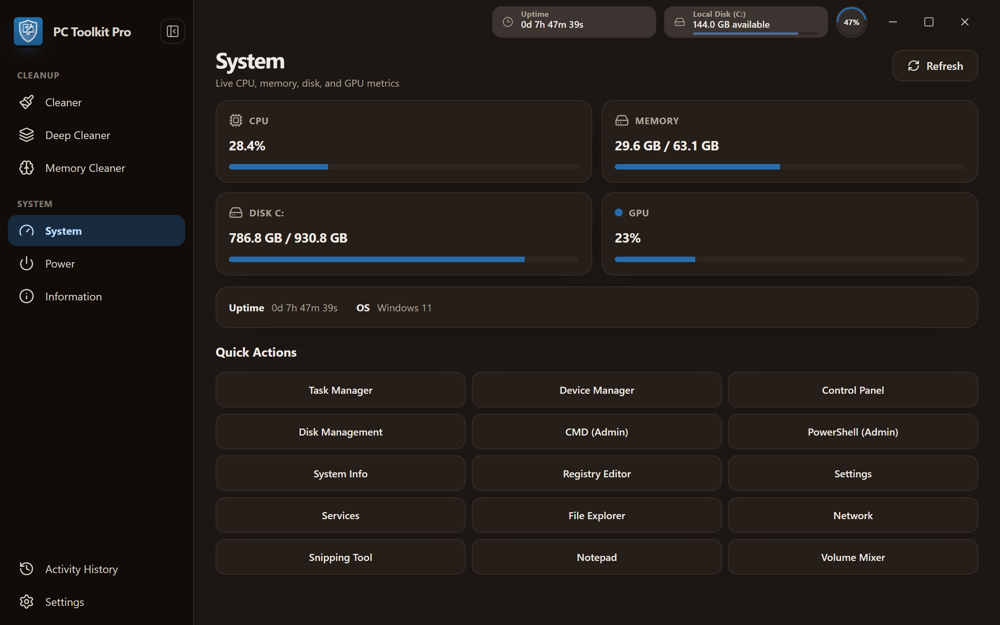
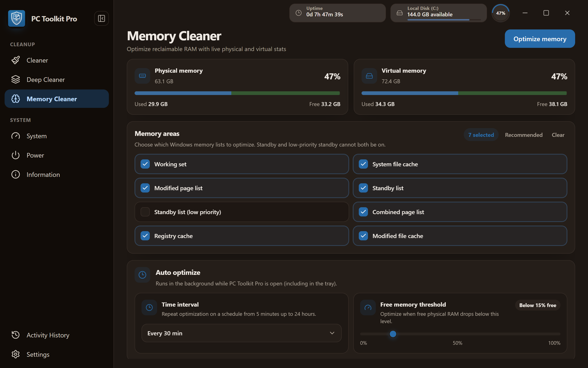
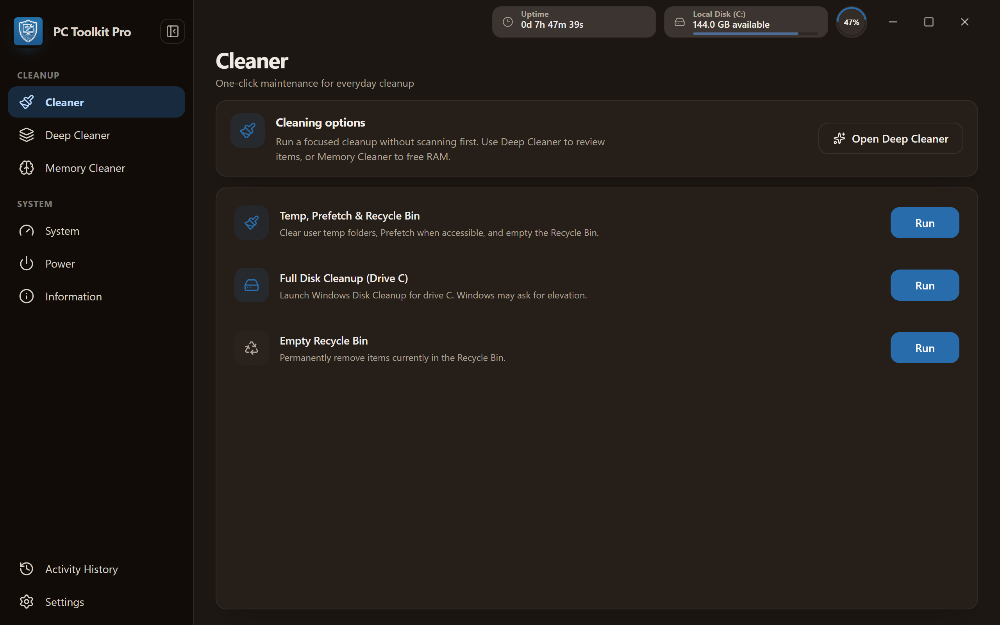
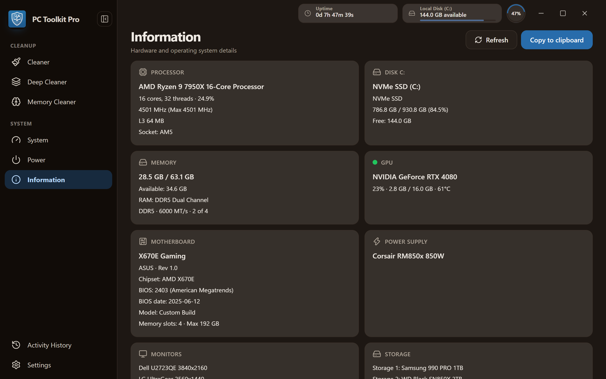

# PC Toolkit Pro

**Windows PC cleaner · RAM / memory optimizer · junk file cleaner · system monitor · power tools**

<p align="center">
  
</p>

<p align="center">
  <strong>Free Windows system utility</strong> to clean junk files, free RAM, monitor CPU/disk/GPU, control power options, and manage your PC from a soft modern desktop app + system tray.
</p>

<p align="center">
  <a href="https://github.com/SSujitX/pc-toolkit-pro/releases"></a>
  <a href="LICENSE"></a>
  <a href="https://github.com/SSujitX/pc-toolkit-pro/actions/workflows/tauri-build.yml"></a>
  <a href="https://github.com/SSujitX/pc-toolkit-pro/stargazers"></a>
</p>

<p align="center">
  
  
  
  
  
  
  
</p>

<p align="center">
  <a href="https://github.com/SSujitX/pc-toolkit-pro/releases/latest"><strong>Download PC Toolkit Pro for Windows</strong></a>
  ·
  <a href="#features">Features</a>
  ·
  <a href="#develop">Develop</a>
  ·
  <a href="#build--release">Build</a>
</p>

---

## Why PC Toolkit Pro?

**PC Toolkit Pro** is a lightweight **Windows PC cleaner** and **system manager** for everyday maintenance: remove temp/junk files, **optimize memory / free RAM**, watch live resource usage, run quick Windows tools, schedule shutdown, and keep a full hardware report ready to copy.

Rebuilt from the ground up with **Tauri 2 + Vue 3 + Rust** for a fast, native-feeling desktop app — soft dense UI, hide-to-tray, signed auto-updates, and no heavy Electron runtime.

> **Inspiration (patterns only):** dense desktop cleanup chrome akin to [MangoDisk](https://github.com/harry0703/MangoDisk), plus Windows memory-clean workflows akin to [Win Memory Cleaner](https://github.com/IgorMundstein/WinMemoryCleaner) — original PC Toolkit Pro code, branding, and MIT license.

---

## Screenshots

<p align="center">
  
</p>
<p align="center">
  
</p>
<p align="center">
  
</p>
<p align="center">
  
</p>

---

## Features

| Area | What you get |
|------|----------------|
| **Junk / disk cleaner** | Scan → confirm → clean temp, prefetch, recycle, and related junk with progress + cancel. Default scan works without admin (skip-and-continue on denied paths). |
| **Deep cleaner** | Broader cleanup categories for deeper Windows disk cleanup sessions. |
| **Memory cleaner / RAM optimizer** | Selectable memory areas, live physical & virtual RAM stats, auto-clean (from 5 minutes + free-RAM threshold). Real Win32 APIs — honest skip when elevation is missing. |
| **System monitor** | Live CPU, RAM, disk, and NVIDIA GPU metrics in-app and in the titlebar. |
| **System tray** | Hide-to-tray, live RAM tooltip, Clean Memory, power shortcuts — same settings as the Memory page. |
| **Power tools** | Shutdown, restart, sleep, lock, and scheduled shutdown. |
| **Quick Actions** | One-click launch of common Windows tools and admin shells. |
| **System information** | Full hardware report (CPU, disks, RAM, GPU, monitors, motherboard, OS, PSU when available) with clipboard export. |
| **Activity history** | Local history of cleaner / memory / power operations. |
| **Settings & updates** | Theme (light / dark / system), About dialog, and signed in-app updates from GitHub Releases. |

**Keywords this project targets:** Windows cleaner, PC cleaner, junk file cleaner, temp file cleaner, disk cleanup, RAM cleaner, memory cleaner, free RAM, memory optimizer, Windows optimizer, system utility, system tray cleaner, Tauri Windows app, Vue desktop app.

---

## Stack

- **Shell:** Tauri 2 (window starts hidden until Vue mounts — no startup hang)
- **UI:** Vue 3 + TypeScript + Pinia + Tailwind CSS 4 + soft dense **PC Toolkit Pro** chrome
- **Backend:** `pctoolkit-core` (product logic, no Tauri) + `pctoolkit-platform` (Windows OS facts / Win32)
- **Updates:** `@tauri-apps/plugin-updater` + signed NSIS artifacts on GitHub Releases

---

## Download

1. Open **[Releases](https://github.com/SSujitX/pc-toolkit-pro/releases/latest)**
2. Install with the **NSIS setup** (`PC-Toolkit-Pro-*-setup.exe`), or run the portable EXE
3. Optional: keep the app in the tray for quick **Clean Memory** and power actions

CI artifacts (unsigned / pre-release builds) are also available from **Actions → Build Windows EXE**.

---

## Develop

```bash
pnpm install
pnpm tauri:dev
```

Needs **Rust stable** and **Windows C++ / MSVC** build tools. If `link.exe` is missing locally, use GitHub Actions for real `.exe` builds.

UI-only preview (no Rust link):

```bash
pnpm dev
```

---

## Build & release

```bash
pnpm tauri:build
```

### GitHub Actions (recommended)

Workflow: [`.github/workflows/tauri-build.yml`](.github/workflows/tauri-build.yml)

1. Push to `feat/tauri-rewrite` (or **Actions → Build Windows EXE → Run workflow**)
2. Open the finished run → **Artifacts**
3. Download `pc-toolkit-pro-windows-<sha>` (NSIS installer + portable EXE)

### Version + tagged release

Single source of truth: root [`VERSION`](VERSION) (`X.Y.Z`).

```bash
echo 3.0.1 > VERSION
pnpm version:sync
pnpm version:check

git commit -am "chore: bump version to 3.0.1"
git tag v3.0.1
git push origin v3.0.1
```

Tag `vX.Y.Z` (must match `VERSION`) runs [`.github/workflows/release-windows.yml`](.github/workflows/release-windows.yml), publishes a GitHub Release, and (with signing secrets) attaches updater `latest.json` for in-app updates.

---

## Branch note

Active Tauri rewrite: **`feat/tauri-rewrite`**.  
Legacy PyQt docs/release notes on **`master`** stay until this branch is merged and published as the mainline Windows build.

---

## License

[MIT](LICENSE) © PC Toolkit Pro / [SSujitX](https://github.com/SSujitX)

---

<p align="center">
  <sub>
    PC Toolkit Pro — Windows junk cleaner, RAM memory optimizer, system monitor, and power toolkit.
    Built with Tauri, Vue, and Rust.
  </sub>
</p>
